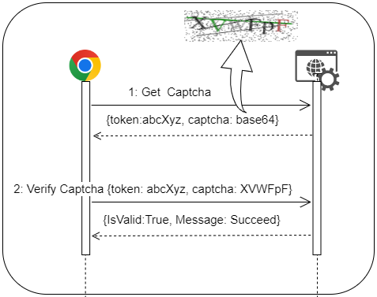

<a href="https://github.com/ngotruong09">
  <p align="center">
    
  </p>
</a>

> Source tại: https://github.com/ngotruong09/AbpCaptcha.git

## Tổng quan

Đây là một thư viện tạo captcha được sử dụng trên framework Abp. Các chức năng chính:
- [x] Tạo captcha
- [x] Verify captcha

## Cách sử dụng

Install package từ nuget hoặc clone source [here](https://github.com/ngotruong09/AbpCaptcha.git) để sử dụng:

```bash
Install-Package AbpCaptcha -Version 1.0.0
```

Tiếp theo, thêm `[DependsOn(typeof(CaptchaModule))]` vào class ABP module trong project của bạn.

Sau đó, sử dụng service `ICaptchaEngine` để `GetCaptcha/VerifyCaptcha` captcha.

## Cách cấu hình

Cấu hình trong file appsettings.json

```bash
{
  "Captcha": {
    "FontFamilies": [ "Arial", "Times New Roman" ],
    "Timeout": 300,
    "Pattern": "abcdefghijkmnpqrstuvwxyzABCDEFGHJKLMNPQRSTUVXYZW23456789",
    "SizeText": 6,
    "DrawLines": 4
  }
}
```

Hoặc trong `ConfigureServices` :

```bash
Configure<CaptchaOptions>(options =>
{
     options.FontFamilies = new string[] {"Arial", "Times New Roman"};
     options.Timeout = 300;
     options.Pattern = "abcdefghijkmnpqrstuvwxyzABCDEFGHJKLMNPQRSTUVXYZW23456789";
     options.SizeText = 6;
     options.DrawLines = 4;
});
```

Ý nghĩa một số tham số cấu hình:
- `FontFamilies` : font của captcha (hình);
- `Timeout` : thời gian expired của captcha, thời gian chờ người dùng nhập captcha, tính bằng giây;


